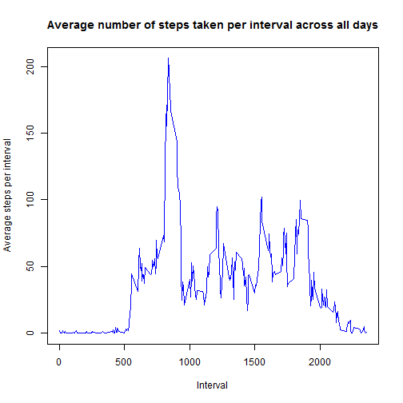

# Reproducible Research: Peer Assessment 1

## Introduction

This is the first peer assessed project for the Reproducible Research course in Coursera's Data Science specialization track. The purpose of the 
project is to apply knowledge learnt in earlier courses answer a series of questions using data collected from a personal activity monitoring device.

## Data

The data for this assignment was downloaded from the course web site:
.	Dataset: Activity monitoring data [52K]
The variables included in this dataset are:
.	steps: Number of steps taking in a 5-minute interval (missing values are coded as NA)
.	date: The date on which the measurement was taken in YYYY-MM-DD format
.	interval: Identifier for the 5-minute interval in which measurement was taken
The dataset is stored in a comma-separated-value (CSV) file and there are a total of 17,568 observations in this dataset

## Analysis

##### Loading and and processing the data 

```r
# Read and load the required dataset
setwd("C:/Users/01420965/Documents/Coursera/ReproducibleResearch/PJ1")
library(knitr)
dataFile <- "./activity.csv"
data <- read.csv(dataFile, header=TRUE)
#Check field types
str(data)
```

```
## 'data.frame':	17568 obs. of  3 variables:
##  $ steps   : int  NA NA NA NA NA NA NA NA NA NA ...
##  $ date    : Factor w/ 61 levels "2012-10-01","2012-10-02",..: 1 1 1 1 1 1 1 1 1 1 ...
##  $ interval: int  0 5 10 15 20 25 30 35 40 45 ...
```
#### What is mean total number of steps taken per day?
    *Calculate the total number of steps taken per day.
    *Make a histogram of the total number of steps taken per day.
    *Calculate and report the mean and median of the total number of steps taken per day.

```r
totalStepsPerDay <- aggregate(steps ~ date, data, sum)
hist(totalStepsPerDay$steps, main = paste("Histogram of total steps taken per day"), col="grey", xlab="Total number of steps", ylab="Frequency-number of days")
```

 

```r
dev.off()
```

```
## null device 
##           1
```

```r
meanStepsPerDay <- mean(totalStepsPerDay$steps)
print(meanStepsPerDay)
```

```
## [1] 10766.19
```

```r
medianStepsPerDay  <- median(totalStepsPerDay$steps)
print(medianStepsPerDay)
```

```
## [1] 10765
```
The mean total steps per day is : 1.0766189 &times; 10<sup>4</sup> and median total steps per day is : 10765

#### What is the average daily activity pattern?
  1. Make a time series plot (i.e. type = "l") of the 5-minute interval (x-axis) and the average number of steps taken, averaged across all days (y-axis)
  2. Which 5-minute interval, on average across all the days in the dataset, contains the maximum number of steps?

```r
avgStepsPerInterval <- aggregate(steps ~ interval, data, mean)
plot(avgStepsPerInterval$interval,avgStepsPerInterval$steps, type="l", col="blue", xlab="Interval", ylab="Average steps per interval",main="Average number of steps taken per interval across all days")
```

 

```r
max5minInterval <- avgStepsPerInterval[which.max(avgStepsPerInterval$steps),1]
print(max5minInterval)
```

```
## [1] 835
```
The 5 minute interval with the maximum number of steps is the  835th interval

#### Imputing missing values

1. Calculate and report the total number of missing values in the dataset (i.e. the total number of rows with NAs)

2. Devise a strategy for filling in all of the missing values in the dataset. The strategy does not need to be sophisticated. For example, you could use the mean/median for that day, or the mean for that 5-minute interval, etc.

3. Create a new dataset that is equal to the original dataset but with the missing data filled in.

4. Make a histogram of the total number of steps taken each day and Calculate and report the mean and median total number of steps taken per day. Do these values differ from the estimates from the first part of the assignment? What is the impact of imputing missing data on the estimates of the total daily number of steps?

```r
missingValues <- sum(is.na(data$steps))
print(missingValues)
```

```
## [1] 2304
```

```r
# missingValues <- sum(!complete.cases(data)) This will just work as fine for missing values
```
The total number of missing values in the dataset is 2304

The strategy implemented involves merging the original dataset with a dataset of mean steps values per interval. These will be merged on the common id, the interval. The resultant
dataset will have two variables of steps, one being the original and the other being the mean values. The mean values will then be used to replace the NAs in the original step variable.

```r
library(dplyr)
mergedDataset <- inner_join(data,avgStepsPerInterval,by="interval")
str(mergedDataset)
```

```
## 'data.frame':	17568 obs. of  4 variables:
##  $ steps.x : int  NA NA NA NA NA NA NA NA NA NA ...
##  $ date    : Factor w/ 61 levels "2012-10-01","2012-10-02",..: 1 1 1 1 1 1 1 1 1 1 ...
##  $ interval: int  0 5 10 15 20 25 30 35 40 45 ...
##  $ steps.y : num  1.717 0.3396 0.1321 0.1509 0.0755 ...
```

```r
missingValues <- is.na(mergedDataset$steps.x)
mergedDataset$steps.x[missingValues] <- mergedDataset$steps.y[missingValues]
filledDataset <- transform(mergedDataset,steps = steps.x, steps.x=NULL, steps.y=NULL)
```
Histogram, mean and median of the total number of steps taken each day from the dataset with imputed values.

```r
totalStepsPerDay_i <- aggregate(steps ~ date, filledDataset, sum)
hist(totalStepsPerDay$steps, main = paste("Histogram of total steps taken per day"), col="grey", xlab="Total number of steps", ylab="Frequency-number of days")
```

 

```r
dev.off()
```

```
## null device 
##           1
```

```r
meanStepsPerDay_i <- mean(totalStepsPerDay_i$steps)
print(meanStepsPerDay_i)
```

```
## [1] 10766.19
```

```r
medianStepsPerDay_i  <- median(totalStepsPerDay_i$steps)
print(medianStepsPerDay_i)
```

```
## [1] 10766.19
```
The mean total steps per day is : 1.0766189 &times; 10<sup>4</sup> and median total steps per day is : 1.0766189 &times; 10<sup>4</sup>

The impact of imputing missing data on the estimates of the total daily number of steps is that both the mean and the median are both the same.
This is because there were a lot of missing values that were replaced with the mean values.

#### Are there differences in activity patterns between weekdays and weekends?

For this part the weekdays() function may be of some help here. Use the dataset with the filled-in missing values for this part.

1. Create a new factor variable in the dataset with two levels - "weekday" and "weekend" indicating whether a given date is a weekday or weekend day.

2. Make a panel plot containing a time series plot (i.e. type = "l") of the 5-minute interval (x-axis) and the average number of steps taken, averaged across all weekday days or weekend days (y-axis). See the README file in the GitHub repository to see an example of what this plot should look like using simulated data.

```r
weekdays <- c("Monday", "Tuesday", "Wednesday", "Thursday","Friday")
filledDataset$dayofweek = as.factor(ifelse(is.element(weekdays(as.Date(filledDataset$date)),weekdays), "Weekday", "Weekend"))
str(filledDataset)
```

```
## 'data.frame':	17568 obs. of  4 variables:
##  $ date     : Factor w/ 61 levels "2012-10-01","2012-10-02",..: 1 1 1 1 1 1 1 1 1 1 ...
##  $ interval : int  0 5 10 15 20 25 30 35 40 45 ...
##  $ steps    : num  1.717 0.3396 0.1321 0.1509 0.0755 ...
##  $ dayofweek: Factor w/ 2 levels "Weekday","Weekend": 1 1 1 1 1 1 1 1 1 1 ...
```

```r
head(filledDataset)
```

```
##         date interval     steps dayofweek
## 1 2012-10-01        0 1.7169811   Weekday
## 2 2012-10-01        5 0.3396226   Weekday
## 3 2012-10-01       10 0.1320755   Weekday
## 4 2012-10-01       15 0.1509434   Weekday
## 5 2012-10-01       20 0.0754717   Weekday
## 6 2012-10-01       25 2.0943396   Weekday
```

```r
avgStepsPerInterval_i <- aggregate(steps ~ interval + dayofweek, data=filledDataset, FUN=mean)
library(lattice)
xyplot(avgStepsPerInterval_i$steps ~ avgStepsPerInterval_i$interval|avgStepsPerInterval_i$dayofweek, main="Average steps per day by Interval",col="blue", xlab="Interval", ylab="Steps",layout=c(1,2), type="l")
```

 

There seems to be a difference between weekend and weekday activity patterns. During weekdays, activity starts around 06:00 hrs and 
is more intense at around 8:30, probably going to work. On weekends, activity starts slightly later and is more spread out without a very pronounced peak.


